# OrderCoffeeApp ☕️

**OrderCoffeeApp** 是一款模擬 **星巴克點餐體驗** 的 iOS 應用程式，讓使用者可以 **快速瀏覽飲品、選擇門市、完成訂單並追蹤歷史紀錄**。  
支援 **Apple Sign-In、Google Sign-In、Email 登入**，並整合 **Firebase** 以確保順暢的訂單處理與個人帳戶管理。  
透過 **即時搜尋、收藏最愛飲品、個人化設定**，提供更便利的咖啡購買體驗。

## 📖 目錄

1. [📌 主要功能](#📌-主要功能)
   - [🎬 操作影片](#📌-主要功能)
2. [🛠 主要技術 & 第三方套件](#🛠-主要技術--第三方套件)
3. [🖥️ 介面預覽](#🖥️-介面預覽)
   - [🔑 登入、註冊、忘記密碼](#-登入註冊忘記密碼)
   - [☕ 飲品菜單](#-飲品菜單)
   - [🛒 訂單購物車](#-訂單購物車)
   - [📝 訂單資訊填寫](#-訂單資訊填寫)
   - [📍 門市選擇](#-門市選擇)
   - [✅ 訂單確認](#-訂單確認)
   - [🔍 搜尋](#-搜尋)
   - [❤️ 收藏](#-收藏)
   - [👤 個人頁面 & 設定](#-個人頁面--設定)
   - [✏️ 個人資訊編輯](#-個人資訊編輯)
   - [📜 訂單歷史紀錄](#-訂單歷史紀錄)
   - [📄 歷史訂單詳細資訊](#-歷史訂單詳細資訊)
4. [📋 Requirements](#📋-requirements)
5. [👤 Maintainer](#👤-maintainer)
6. [📚 延伸閱讀（Medium 系列完整教學）](#📚-延伸閱讀medium-系列完整教學)

## 📌 主要功能

🎬 **App 操作展示影片**（點擊預覽圖可觀看完整操作流程）：

---

本專案涵蓋以下功能模組與互動流程，從使用者登入 → 飲品瀏覽 → 購物車 → 訂單提交 → 訂單歷史與個人資料編輯，完整模擬星巴克點餐體驗。

---

### 🚀 登入與使用者管理
- ✅ **快速登入**：支援 **Apple Sign-In、Google Sign-In、Email 註冊與登入**，確保帳戶安全性。
- 🔑 **忘記密碼**：提供 **密碼重設功能**，讓使用者能夠快速找回帳號。

### ☕ 瀏覽與點餐
- 📜 **飲品菜單**：顯示 **完整飲品清單**，可查看 **價格、介紹與圖片**。
- 🛒 **訂單項目購物車**：管理已選購的飲品，支援 **數量、尺寸調整** 與 **移除項目**。
- 📍 **門市選擇**：透過 **地圖模式** 或 **列表模式**，選擇最近或最喜愛的門市。

### 📦 訂單處理
- 📝 **訂單顧客資訊**：填寫 **聯絡資訊、取餐方式**，確保訂單正確。
- ✅ **訂單完成**：下單後顯示 **訂單資料**，並且提醒顧客訂單是否完成。

### 🔍 搜尋與收藏
- 🔎 **搜尋系統**：透過 **飲品關鍵字搜尋**，快速找到想要的咖啡。
- ❤️ **我的最愛**：將 **常點飲品** 加入收藏清單，快速重新訂購。

### 👤 個人設定與歷史紀錄
- 🎭 **個人頁面**：查看 **帳號資訊**，以及提供**星巴克社交資訊**管理設定等。
- 📝 **個人資訊編輯**：修改 **姓名、頭像、聯絡資訊** 等個人資料。
- 📜 **歷史訂單管理**：查看 **過去訂單**，或追蹤過往訂單紀錄。

## 🛠 主要技術 & 第三方套件
這個專案主要使用以下技術來實現完整的點餐功能：

### **Firebase**
| Firebase 服務 | 用途 |
|--------------|-----------|
| Firestore | 存儲 **飲品資料、訂單、使用者資訊** |
| Firebase Auth | 提供 **Apple、Google、Email 登入** |
| Firebase Storage | 儲存 **使用者頭像 & 飲品圖片** |

**為何選擇 Firebase？**
- **即時同步**：Firestore 支援即時數據更新，適合處理「訂單狀態變更」。
- **身份驗證整合**：Firebase Auth 提供 Apple Sign-In、Google Sign-In 等，減少開發成本。

---

### **主要第三方套件**
這些套件皆透過 **Swift Package Manager (SPM)** 安裝與管理。

| 套件 | 作用 |
|------|-----------|
| **Kingfisher** | 快速加載 **飲品圖片 & 使用者大頭貼**，並支援快取 |
| **JGProgressHUD** | **加載指示器**，提供更流暢的 UI 體驗 |
| **IQKeyboardManagerSwift** | 自動管理鍵盤 **避免輸入欄被擋住** |
| **FloatingPanel** | 底部彈出視圖，提供更直覺的 **篩選門市選擇體驗** |
| **Lottie** | 動畫處理，提升 UI 動畫流暢度 |

---

**SPM 安裝方式**  
在 **Xcode > File > Swift Packages > Add Package Dependency...** 中輸入以下 URL：

| 套件 | GitHub URL |
|------|-----------|
| **Firebase** | [firebase/firebase-ios-sdk](https://github.com/firebase/firebase-ios-sdk) |
| **Kingfisher** | [onevcat/Kingfisher](https://github.com/onevcat/Kingfisher) |
| **JGProgressHUD** | [JonasGessner/JGProgressHUD](https://github.com/JonasGessner/JGProgressHUD) |
| **IQKeyboardManagerSwift** | [hackiftekhar/IQKeyboardManager](https://github.com/hackiftekhar/IQKeyboardManager) |
| **FloatingPanel** | [scenee/FloatingPanel](https://github.com/scenee/FloatingPanel) |
| **Lottie** | [airbnb/lottie-ios](https://github.com/airbnb/lottie-ios) |

## 🖥️ 介面預覽

### 🔑 登入、註冊、忘記密碼
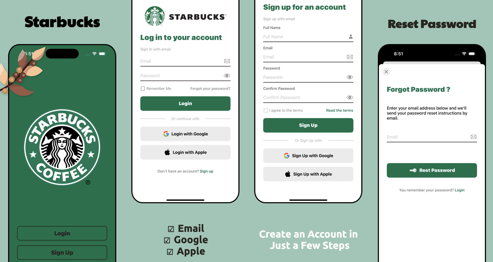

應用程式的 **登入與註冊頁面**，提供 **Apple Sign-In、Google Sign-In、Email 註冊與登入**，確保帳戶安全。  

- **「記住我」功能**：可選擇記住登入資訊，下次登入更快速。
- **登入、註冊成功後**：自動跳轉到主畫面 (`MainTabBarController`)。
- **忘記密碼**：點擊 **「Forgot your password？」**，輸入 Email，即可收到重設密碼的郵件。

> 💡 若 Email 尚未註冊，系統會顯示錯誤提醒，避免用戶混淆。

---

### ☕ 飲品菜單
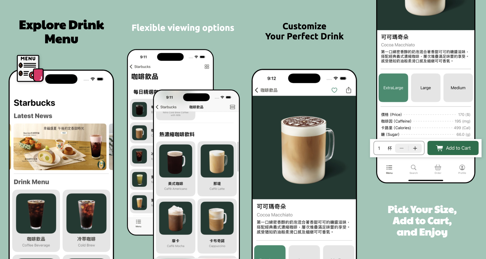

應用程式提供 **完整飲品清單**，讓使用者能輕鬆找到喜愛的咖啡：

- **分類瀏覽**：透過 **類別 (Category) 與子類別 (Subcategory)** 進行飲品篩選。

- **直覺式操作**：支援 **列表 / 網格視圖切換**，滿足不同使用者需求。

- **飲品詳情**：
  - 查看 **價格、描述、熱量、咖啡因含量** 等資訊。
  - **動態選擇尺寸**，即時更新價格。
  
- **加入購物車**：
  - 選擇 **尺寸與數量**，加入購物車。
  - **即時計算總額**，確保結帳前資訊透明。

> 💡 **貼心提示**：點擊飲品可進入 **詳細頁面**，查看更多資訊。

---

### 🛒 訂單購物車
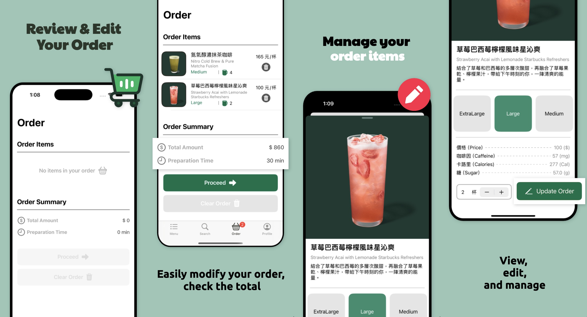

使用者可在「訂單購物車」頁面管理已選購的飲品，確保訂單內容正確無誤：

- **訂單調整**：
  - 支援 **調整數量、選擇尺寸、移除單品**。
  - 動態更新 **價格與準備時間**，確保顯示即時資訊。
  
- **訂單管理**：
  - 可 **單獨刪除品項** 或 **清空整個購物車**。
  - **刪除操作皆有確認彈窗**，避免誤刪。
  
- **結帳前確認**：
  - 顯示 **訂單總金額** 與 **預估準備時間**。
  - 點擊「下一步」進入 **顧客資料填寫** 頁面，完成訂單資訊確認。

> 💡 **小提示**：根據當前訂單數量，動態更新訂單頁面的 badge。

---

### 📝 訂單資訊填寫
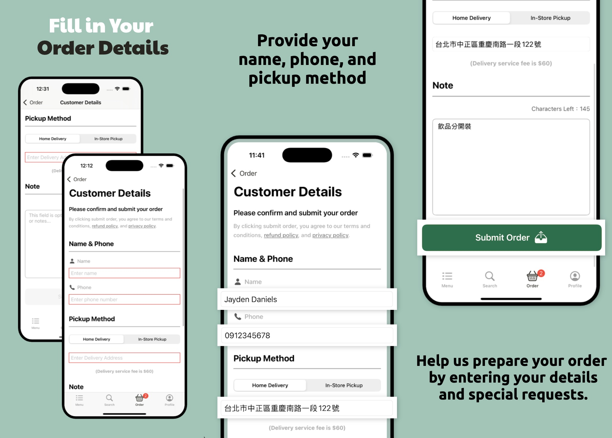

使用者可在「訂單資訊填寫」頁面輸入 **取餐資訊、聯絡方式、額外備註**，確保訂單正確無誤：

- **訂單資訊填寫**：
  - **姓名、電話**：如果用戶已在 **個人資訊** 頁面填寫，則會自動帶入。
  - **取餐方式**：
    - **門市取餐**：選擇最近門市（**可從地圖/列表挑選**）。
    - **外送服務**：需填寫詳細 **外送地址**（自動帶入個人資訊）。
  - **額外備註**：可填寫特殊需求，例如「少糖」、「多冰」等。

- **表單驗證機制**：
  - **姓名、電話、取餐方式** 為 **必填欄位**，若未填寫，則會提示錯誤。
  - 若選擇 **外送**，則 **外送地址** 為 **必填欄位**，未填寫將無法提交。

- **訂單提交**：
  - 點擊「提交訂單」後，系統將確認資料完整性並顯示 **訂單確認完成頁面**。

> 💡 **貼心提醒**：**門市取餐** 可透過地圖選擇門市，**外送服務** 則可直接帶入個人地址，避免手動輸入。

---

### 📍 門市選擇
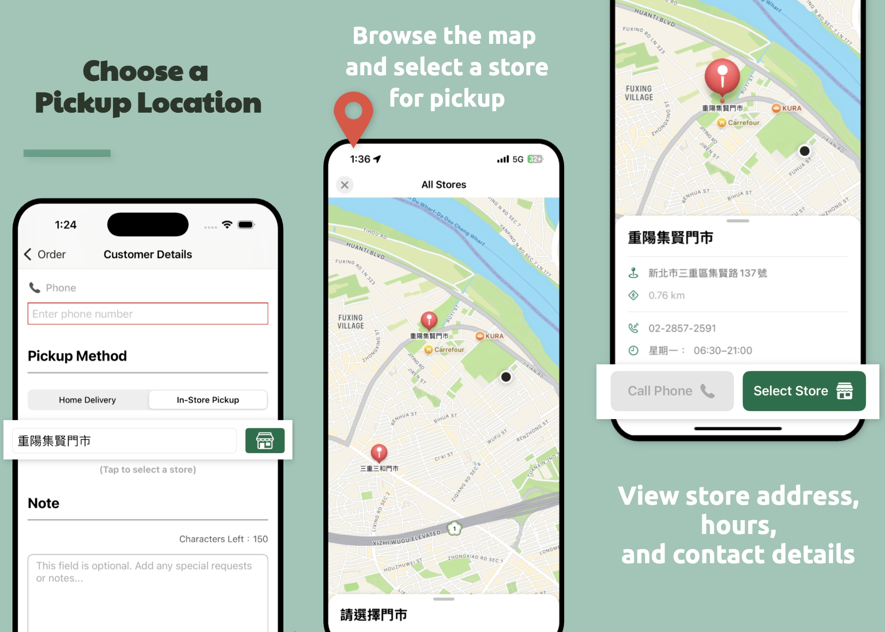

使用者可透過 **地圖模式** 選擇取餐門市，確保找到最適合的門市：

- **地圖模式**：
  - 直覺式互動地圖，標示所有可用門市。
  - **自動定位** 顯示最近門市（需授權位置權限）。
  - 點擊門市標記，開啟 **浮動面板**，查看 **門市名稱、地址、距離、營業時間** 等資訊。
  - 點擊「選擇門市」，即確認該門市為取餐地點。

- **其他功能**：
  - **直接撥打門市電話**，詢問店家狀況。

- **確認選擇**：
  - 選擇門市後，系統會自動返回「訂單資訊填寫」頁面，顯示已選門市資訊。
  - 若需修改，可點擊「變更門市」，重新選擇。

> 💡 **小技巧**：如果未開啟定位權限，可手動選擇門市！

---

### ✅ 訂單確認
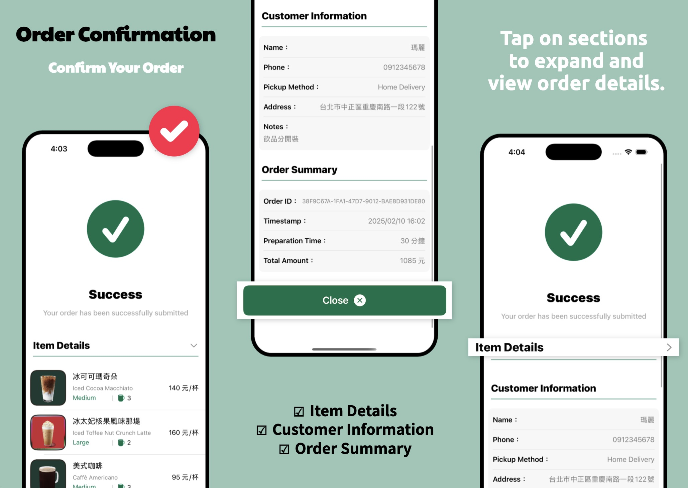

當訂單成功提交後，系統將顯示 **訂單確認頁面**，包含完整的訂單資訊，確保用戶了解訂單內容：

- **訂單詳細內容**
  - **訂單編號**：用於查詢與追蹤訂單。
  - **訂單項目**：可 **展開/收起** 飲品清單，查看每項商品的詳細資訊。
  - **取餐方式**：顯示 **門市名稱** 或 **外送地址**，確保用戶取餐無誤。
  - **預估準備時間**：讓用戶掌握飲品完成的時間。

- **訂單管理**
  - **📩 訂單通知**：訂單的 **準備時間** 完成後提醒用戶訂單已經準備好取件。

- **返回操作**
  - **返回首頁**：
    - 點擊 **「Close」**，系統將清空目前的訂單數據，導向首頁。
    - **系統會詢問確認**，避免誤操作。
    - **不影響訂單狀態**，可隨時返回歷史訂單頁面查看。

> 💡 **小技巧**：訂單確認後，仍可至「訂單歷史紀錄」查詢訂單！

---

### 🔍 搜尋
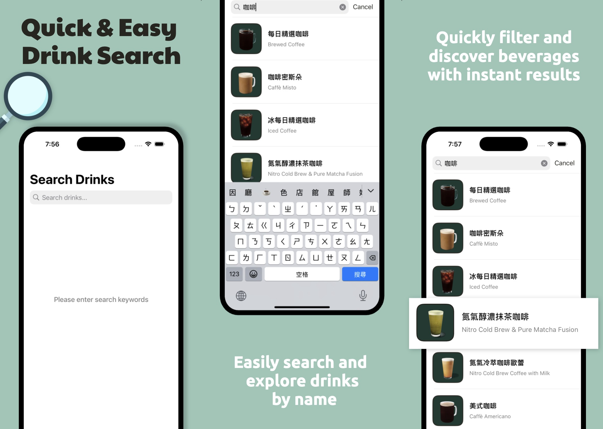

使用者可透過 **飲品名稱、關鍵字搜尋**，快速找到喜愛的咖啡，搜尋結果會即時更新，無需額外確認：

- **即時搜尋**  
  - 當使用者輸入關鍵字時，搜尋結果會 **即時變更**，無需點擊確認按鈕。  
  - 可搜尋 **飲品名稱、關鍵字**，例如「拿鐵」、「抹茶」等。

- **快速搜尋（本地快取）**  
  - 搜尋功能不會額外請求 Firebase，所有資料皆來自本地快取，提高搜尋速度。  
  - 可在 **無網路狀態下** 進行搜尋（前提是快取仍然有效）。

- **搜尋結果為空時的處理**  
  - 若沒有匹配的飲品，畫面會顯示 **「沒有搜尋結果」** 的提示。  
  - 可重新調整關鍵字。

- **搜尋資料無效時的處理**  
  - 若搜尋時快取資料無效，系統會顯示 **「資料無效，請點擊載入」** 的警示框。  
  - 使用者可點擊「載入」按鈕重新加載飲品資料，確保搜尋功能可用。

> 💡 **小提示**：  
> - 搜尋範圍僅限於「飲品」，不包含門市名稱、訂單等內容。  
> - **搜尋結果可點擊**，進入 **飲品詳情頁面** 查看更多資訊。  

---

### ❤️ 收藏
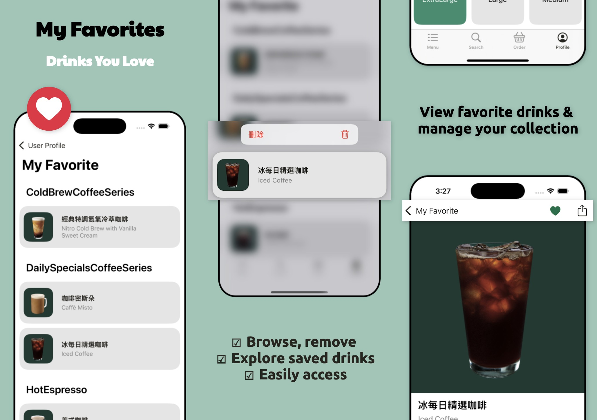

使用者可以 **將喜愛的飲品加入「我的最愛」**，快速存取常點的咖啡，並透過 **收藏管理頁面** 進行管理：

- **加入收藏**  
  - 在 **飲品詳細頁面** 點擊 ❤️ 按鈕，即可將該飲品加入收藏清單。
  - 收藏的飲品會根據 **飲品子分類** 進行分類，方便使用者查找。

- **移除收藏**
  - 在 **「我的最愛」頁面**，可 **長按飲品** 來刪除收藏。  
  - 刪除後，畫面會 **即時更新**，無需手動刷新。

- **即時同步**
  - 收藏狀態 **與 Firebase 同步**，登入不同裝置時，收藏清單仍然保留。  
  - 當 **加入或刪除收藏** 時，資料會自動更新，無需重新整理頁面。

- **沒有收藏時的畫面**
  - 若收藏清單為空，畫面會顯示 **「沒有收藏的提示訊息」**，引導使用者新增飲品。  

> 💡 **小提示**：  
> - 收藏的飲品可 **直接點擊**，進入 **飲品詳情頁面** 查看更多資訊。  

---

### 👤 個人頁面 & 設定
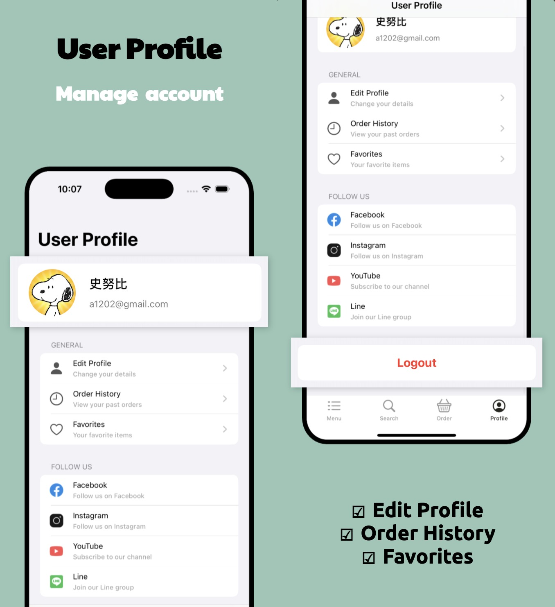

使用者可在 **個人頁面** 中管理個人資訊、歷史訂單與收藏清單，並進行帳戶相關操作：

- **個人資訊**
  - 顯示 **姓名、Email、個人頭像**。
  - 可點擊 **「編輯個人資料」** 進入 **編輯模式**，修改姓名、聯絡資訊、大頭貼等。
  - **所有變更將自動同步至 Firebase**，確保資料跨裝置更新。

- **訂單歷史紀錄**
  - 可查看 **過去訂單**，並點擊進入詳細資訊頁面。
  - 訂單會根據選擇的排序方式，方便使用者快速查找。

- **我的最愛**
  - 可查看所有已收藏的飲品，並點擊查看飲品詳情。
  - 可 **刪除收藏**，畫面會即時更新。

- **社交媒體連結**
  - 可點擊 **Facebook、Instagram** 等連結，開啟外部瀏覽器。
  - 會先顯示 **「確定要前往該網頁？」** 的確認視窗，避免誤點。

- **登出**
  - 點擊「登出」後，系統會顯示 **確認視窗**：
    - **「確定要登出嗎？」**  
    - 選擇「確認」後，系統將登出並回到登入畫面。

> 💡 **小提示**：  
> - 登入後，除非點擊登出，否則會保持登入狀態。

---

### ✏️ 個人資訊編輯
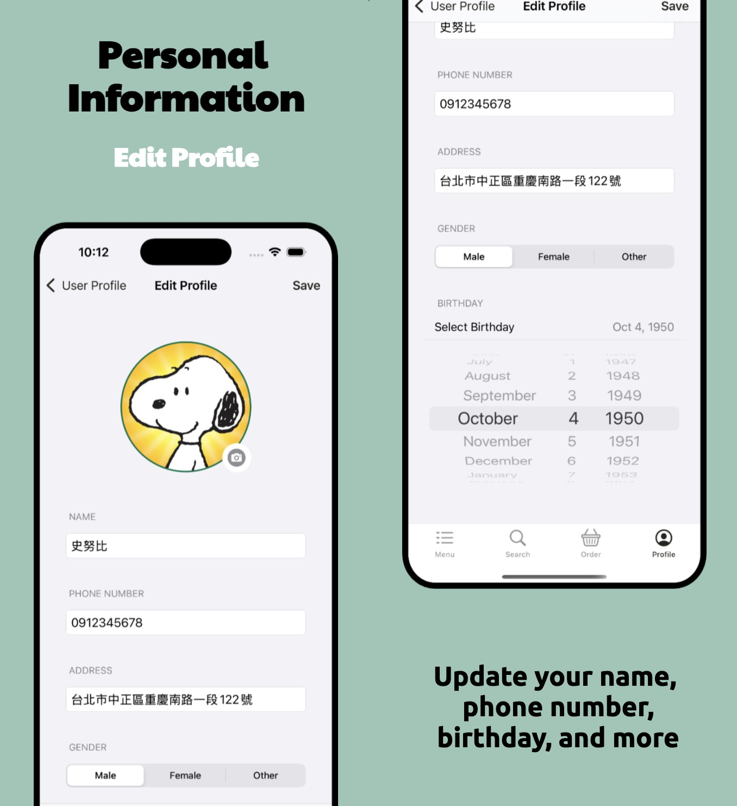

在 **個人資訊編輯** 頁面，使用者可以修改以下個人資料：
- **基本資訊**
  - **姓名（必填）**：若未輸入，將無法儲存。
  - **聯絡資訊**（電話、地址等）。
  - **性別、生日**。

- **大頭照更換**
  - 點擊 **頭像** 可選擇 **拍照** 或 **從相簿選取**。
  - 選擇新圖片後，系統會自動上傳至 **Firebase Storage**，並更新 Firebase 個人資料。

- **Firebase 同步**
  - 變更個人資訊後，系統會立即更新 Firebase，確保 **跨裝置同步**。
  - 若修改內容後未點擊「保存」，則不會更新至 Firebase。

- **表單驗證**
  - **姓名為必填欄位**，若未填寫，則無法點擊「保存」。
  - **電話、地址為選填**，可自由修改。

- **保存個人資料**
  - 點擊「保存」按鈕後，系統將：
    1. **驗證輸入內容**（姓名不可為空）。
    2. **若有變更頭像，則先上傳圖片**。
    3. **更新 Firebase Firestore** 內的個人資料。
    4. **顯示加載指示（HUD）**，避免多次點擊「保存」。
    5. **成功後返回「個人頁面」**，若失敗則顯示錯誤訊息。

> 💡 **小提示**：
> - 修改個人資料後，返回「個人頁面」時，系統將自動更新畫面，無需手動刷新。
> - **若要取消變更**，可直接返回，不影響原本資料。

---

### 📜 訂單歷史紀錄
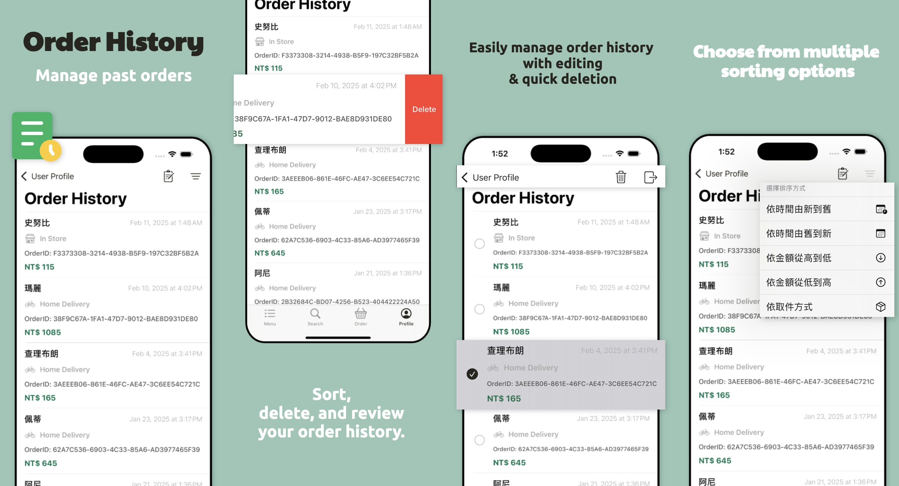

使用者可以在「**訂單歷史紀錄**」頁面中 **查看、管理過去的訂單**，並根據不同需求進行排序與刪除。

- **查看過去訂單**
  - 顯示 **所有已完成的訂單**，包括 **訂單日期、總金額、取餐方式** 等資訊。
  - 可點擊 **單筆訂單** 進入 **訂單詳細資訊** 頁面，查看完整內容。

- **訂單排序**
  - 使用者可以 **選擇不同的排序方式**，快速找到想要的訂單。

- **編輯模式**
  - 點擊 **「編輯」按鈕**，可進入 **多選刪除模式**：
    - **單筆刪除**：滑動 **左滑刪除** 任意訂單。
    - **批量刪除**：選取多筆訂單，一次刪除 **多個紀錄**。
    
> 💡 **小提示**
> - **點擊訂單可查看詳細內容**，包括飲品項目、付款方式、取餐資訊等。

---

### 📄 歷史訂單詳細資訊
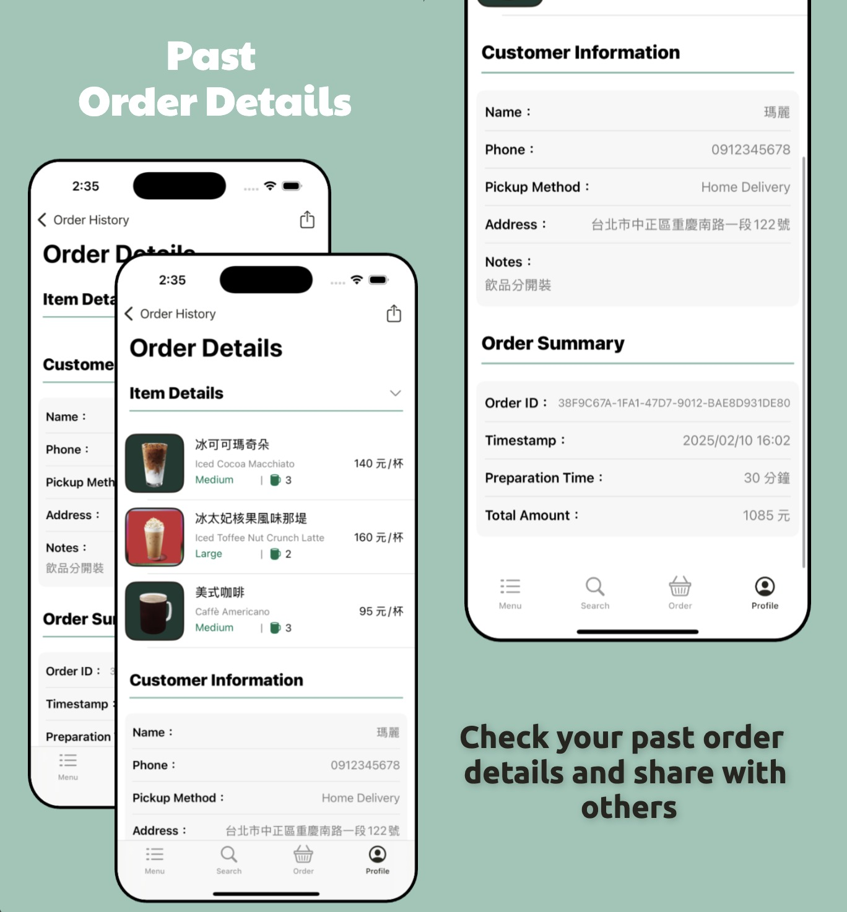

使用者可以在「**歷史訂單詳細資訊**」頁面 **查看完整訂單內容**，包含 **訂單資訊、付款方式、取餐方式與狀態**。

- **訂單編號**
  - 每筆訂單皆有 **唯一的訂單編號**，方便查詢與分享。
  
- **訂單日期與時間**
  - 顯示 **訂單的建立時間**，方便對應訂購時間。

- **訂購品項**
  - 可點擊 **展開/收起** 以查看完整飲品明細。

- **取餐方式**
  - **門市取餐**：顯示 **門市名稱 & 地址**。
  - **外送**：顯示 **外送地址**，若有 **額外備註** 會一併顯示。

- **訂單分享**
  - 點擊 **「分享」按鈕**，選擇 **訊息、社群媒體** 等方式分享。

> 💡 **小提示**
> - 可至「訂單歷史紀錄」頁面快速找到所有訂單。

## 📋 Requirements

- **iOS 16.0 或更新版本**（最低支援 iOS 16）
- **Xcode 15.0+**
- **Swift 5.10+**
- **需要 Firebase API 金鑰與設定檔 (`GoogleService-Info.plist`)**

> ⚠️ **注意**：請確保 Firebase 設定檔 (`GoogleService-Info.plist`) 已正確配置，否則無法登入與存取飲品資料。

## 👤 Maintainer

**OrderCoffeeApp** 是由 [Wei Tsao](https://github.com/a578ff6) 開發。  
如有問題或建議，歡迎聯繫：
- 📧 Email: [a578ff6@gmail.com](mailto:a578ff6@gmail.com)
- 🔗 GitHub: [a578ff6](https://github.com/a578ff6)

## 📚 延伸閱讀（Medium 系列完整教學）

如果你想深入了解本 App 專案的技術架構、Firebase 整合、UI 與訂單流程實作，歡迎參考以下 Medium 系列文章：

### 📘 系列總覽
- [OrderCoffeeApp 系列總覽｜iOS Firebase 點餐 App 完整開發指南](https://medium.com/@a578ff6/ordercoffeeapp-%E7%B3%BB%E5%88%97%E7%B8%BD%E8%A6%BD-ios-firebase-%E9%BB%9E%E9%A4%90-app-%E5%AE%8C%E6%95%B4%E9%96%8B%E7%99%BC%E6%8C%87%E5%8D%97-85019f23c130)

---

### 🔑 使用者登入與驗證

- [#2：在專案中整合 Firebase Auth（Email、Google、Apple 登入）](https://medium.com/@a578ff6/ordercoffeeapp-2-%E5%9C%A8%E5%B0%88%E6%A1%88%E4%B8%AD%E6%95%B4%E5%90%88-firebase-auth-email-google-apple-%E7%99%BB%E5%85%A5-70f4f18c2657)
- [#3：設計 LoginViewController，結合 Firebase 登入](https://medium.com/@a578ff6/ordercoffeeapp-3-%E8%A8%AD%E8%A8%88-loginviewcontroller-%E7%B5%90%E5%90%88-firebase-%E7%99%BB%E5%85%A5-aa06ea50c6a4)
- [#4：設計 SignUpViewController，實作 Firebase 註冊](https://medium.com/@a578ff6/ordercoffeeapp-4-%E8%A8%AD%E8%A8%88-signupviewcontroller-%E5%AF%A6%E4%BD%9C-firebase-%E8%A8%BB%E5%86%8A-92db6f369100)
- [#5：ForgotPasswordViewController 設計與 Firebase 密碼重設](https://medium.com/@a578ff6/ordercoffeeapp-5-forgotpasswordviewcontroller-%E8%A8%AD%E8%A8%88%E8%88%87-firebase-%E5%AF%86%E7%A2%BC%E9%87%8D%E8%A8%AD-07da6e016cb9)

---

### ☕ 菜單與飲品顯示

- [#8：菜單數據模型與 Firestore 整合（Data Layer）](https://medium.com/@a578ff6/ordercoffeeapp-8-%E8%8F%9C%E5%96%AE%E6%95%B8%E6%93%9A%E6%A8%A1%E5%9E%8B%E8%88%87-firestore-%E6%95%B4%E5%90%88-data-layer-99e1f3266545)
- [#9：MenuViewController — 顯示飲品分類](https://medium.com/@a578ff6/ordercoffeeapp-9-menuviewcontroller-%E9%A1%AF%E7%A4%BA%E9%A3%B2%E5%93%81%E5%88%86%E9%A1%9E-a2cf64cc0f72)
- [#10：DrinkSubCategoryViewController — 子分類與飲品清單](https://medium.com/@a578ff6/ordercoffeeapp-10-drinksubcategoryviewcontroller-%E5%AD%90%E5%88%86%E9%A1%9E%E8%88%87%E9%A3%B2%E5%93%81%E6%B8%85%E5%96%AE-73b74d63b6b7)
- [#11：DrinkDetailViewController — 顯示單一飲品詳情](https://medium.com/@a578ff6/ordercoffeeapp-11-drinkdetailviewcontroller-%E9%A1%AF%E7%A4%BA%E5%96%AE%E4%B8%80%E9%A3%B2%E5%93%81%E8%A9%B3%E6%83%85-d2d5a98f994d)

---

### 🔍 搜尋與收藏

- [#12：設計搜尋功能 — 本地快取與 Firebase 整合](https://medium.com/@a578ff6/ordercoffeeapp-12-%E8%A8%AD%E8%A8%88%E6%90%9C%E5%B0%8B%E5%8A%9F%E8%83%BD-%E6%9C%AC%E5%9C%B0%E5%BF%AB%E5%8F%96%E8%88%87-firebase-%E6%95%B4%E5%90%88-66b616c28a6c)
- [#23：我的最愛頁面 - 收藏管理、跨頁同步與動態 UI](https://medium.com/@a578ff6/ordercoffeeapp-23-%E6%88%91%E7%9A%84%E6%9C%80%E6%84%9B%E9%A0%81%E9%9D%A2-%E6%94%B6%E8%97%8F%E7%AE%A1%E7%90%86-%E8%B7%A8%E9%A0%81%E5%90%8C%E6%AD%A5%E8%88%87%E5%8B%95%E6%85%8B-ui-2ad97de47bf4)

---

### 🛒 訂單流程與顧客資料

- [#13：訂單飲品項目 - 設計與管理](https://medium.com/@a578ff6/ordercoffeeapp-13-%E8%A8%82%E5%96%AE%E9%A3%B2%E5%93%81%E9%A0%85%E7%9B%AE-%E8%A8%AD%E8%A8%88%E8%88%87%E7%AE%A1%E7%90%86-c9dd2057f863)
- [#14：編輯訂單項目 - 調整飲品尺寸與數量](https://medium.com/@a578ff6/ordercoffeeapp-14-%E7%B7%A8%E8%BC%AF%E8%A8%82%E5%96%AE%E9%A0%85%E7%9B%AE-%E8%AA%BF%E6%95%B4%E9%A3%B2%E5%93%81%E5%B0%BA%E5%AF%B8%E8%88%87%E6%95%B8%E9%87%8F-d306385be9de)
- [#15：訂單顧客資料 - 訂單填寫與驗證](https://medium.com/@a578ff6/ordercoffeeapp-15-%E8%A8%82%E5%96%AE%E9%A1%A7%E5%AE%A2%E8%B3%87%E6%96%99-%E8%A8%82%E5%96%AE%E5%A1%AB%E5%AF%AB%E8%88%87%E9%A9%97%E8%AD%89-4ceba22d2f13)
- [#16：確認訂單完成 - 顯示訂單資訊與返回主畫面](https://medium.com/@a578ff6/ordercoffeeapp-16-%E7%A2%BA%E8%AA%8D%E8%A8%82%E5%96%AE%E5%AE%8C%E6%88%90-%E9%A1%AF%E7%A4%BA%E8%A8%82%E5%96%AE%E8%B3%87%E8%A8%8A%E8%88%87%E8%BF%94%E5%9B%9E%E4%B8%BB%E7%95%AB%E9%9D%A2-1806a8ab2fdf)

---

### 📍 店鋪選擇與門市資訊

- [#17：店鋪選擇頁面（StoreSelectionViewController）](https://medium.com/@a578ff6/ordercoffeeapp-17-%E5%BA%97%E9%8B%AA%E9%81%B8%E6%93%87%E9%A0%81%E9%9D%A2-storeselectionviewcontroller-cf5807f20ca7)
- [#18：店鋪詳情頁面（StoreInfoViewController）](https://medium.com/@a578ff6/ordercoffeeapp-18-%E5%BA%97%E9%8B%AA%E8%A9%B3%E6%83%85%E9%A0%81%E9%9D%A2-storeinfoviewcontroller-547358dd70a6)

---

### 👤 個人資料與訂單歷史

- [#19：個人資料頁面 - 顯示與管理使用者資訊](https://medium.com/@a578ff6/ordercoffeeapp-19-%E5%80%8B%E4%BA%BA%E8%B3%87%E6%96%99%E9%A0%81%E9%9D%A2-%E9%A1%AF%E7%A4%BA%E8%88%87%E7%AE%A1%E7%90%86%E4%BD%BF%E7%94%A8%E8%80%85%E8%B3%87%E8%A8%8A-ff78ed0d061b)
- [#20：個人資料編輯 - 顯示與更新](https://medium.com/@a578ff6/ordercoffeeapp-20-%E5%80%8B%E4%BA%BA%E8%B3%87%E6%96%99%E7%B7%A8%E8%BC%AF-%E9%A1%AF%E7%A4%BA%E8%88%87%E6%9B%B4%E6%96%B0-3c9599c38138)
- [#21：訂單歷史頁面 - 顯示、管理與排序歷史訂單](https://medium.com/@a578ff6/ordercoffeeapp-21-%E8%A8%82%E5%96%AE%E6%AD%B7%E5%8F%B2%E9%A0%81%E9%9D%A2-%E9%A1%AF%E7%A4%BA-%E7%AE%A1%E7%90%86%E8%88%87%E6%8E%92%E5%BA%8F%E6%AD%B7%E5%8F%B2%E8%A8%82%E5%96%AE-0ee828e7854d)
- [#22：訂單歷史詳情頁 - 顯示訂單詳情、顧客資訊與分享功能](https://medium.com/@a578ff6/ordercoffeeapp-22-%E8%A8%82%E5%96%AE%E6%AD%B7%E5%8F%B2%E8%A9%B3%E6%83%85%E9%A0%81-%E9%A1%AF%E7%A4%BA%E8%A8%82%E5%96%AE%E8%A9%B3%E6%83%85-%E9%A1%A7%E5%AE%A2%E8%B3%87%E8%A8%8A%E8%88%87%E5%88%86%E4%BA%AB%E5%8A%9F%E8%83%BD-109619427373)

---

### 🏗️ 架構與專案初始化

- [#1：專案架構與 Firebase 設計](https://medium.com/@a578ff6/ordercoffeeapp-1-%E5%B0%88%E6%A1%88%E6%9E%B6%E6%A7%8B%E8%88%87-firebase-%E8%A8%AD%E8%A8%88-32be1ec0e669)
- [#6：設計啟動畫面_使用 Lottie 與 Firebase Auth](https://medium.com/@a578ff6/ordercoffeeapp-6-%E8%A8%AD%E8%A8%88%E5%95%9F%E5%8B%95%E7%95%AB%E9%9D%A2-%E4%BD%BF%E7%94%A8-lottie-%E8%88%87-firebase-auth-14dee312e139)
- [#7：Firebase 鉗套結構下的模型設計](https://medium.com/@a578ff6/ordercoffeeapp-7-firebase-%E9%89%97%E5%A5%97%E7%B5%90%E6%A7%8B%E4%B8%8B%E7%9A%84%E6%A8%A1%E5%9E%8B%E8%A8%AD%E8%A8%88-f3b538a74d86)

> 📌 所有文章皆可在系列總覽文中依章節導覽閱讀。